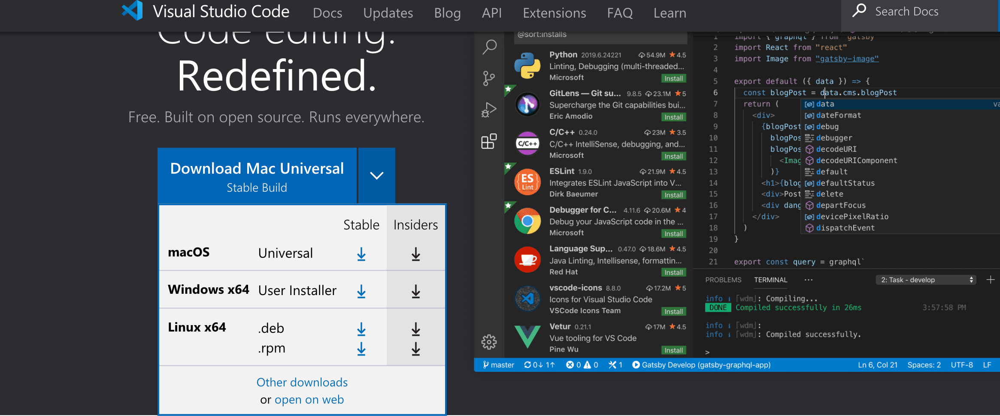
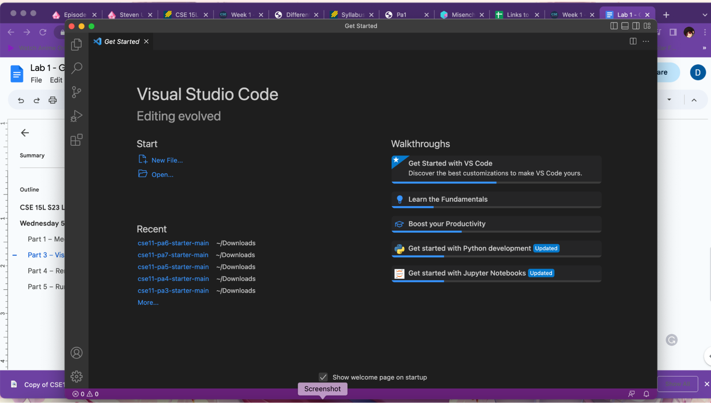

# Lab report (Week 1)

Hello, welcome to CSE 15l. Here I'll provide a tutorial to help get you situated into the lab by starting with logging into your personal course account through remote access.
---
## Installing VScode
We'll start by installing an IDE (intergrated development enviroment) it's just a program that coders use to write code. In this case, we'll be using VScode for the rest of this quarter. Follow this link, [https://code.visualstudio.com/](https://code.visualstudio.com/) and download the package that coresponds to your device by using the arrow drop down menu.

After following instructions and opening the file, you should be left with the VScode interface looking simlar to this:

(It's ok if your interface doesn't look exactly like the version in this photo, as the version of VScode in the picture was dated from 2022)
---
## Remotely Connecting
(for window users!

