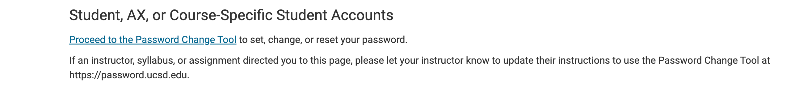
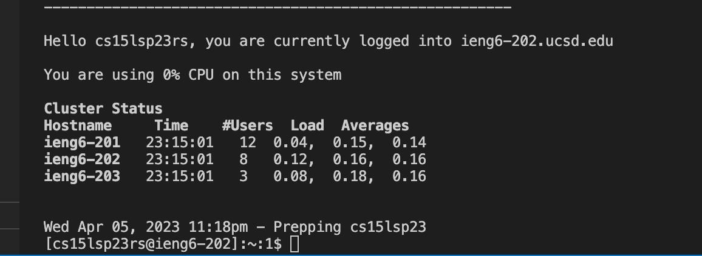
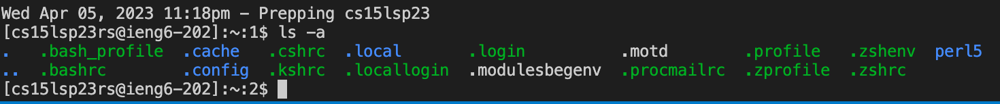

# Lab report (Week 1)

Hello, welcome to CSE 15l. Here I'll provide a tutorial to help get you situated into the lab by starting with logging into your personal course account through remote access.

## Installing VScode
We'll start by installing an IDE (intergrated development enviroment) it's just a program that coders use to write code. In this case, we'll be using VScode for the rest of this quarter. Follow this link, [https://code.visualstudio.com/](https://code.visualstudio.com/) and download the package that coresponds to your device by using the arrow drop down menu.


After following instructions and opening the file, you should be left with the VScode interface looking similar to this:


It's ok if your interface doesn't look exactly like the version in this photo, as the version of VScode in the picture was dated from 2022

## Remotely Connecting 
(for window users!)
Now that we have an IDE seteup, I'll show how to connect to a remote computer through accessing course-specific accounts. If your on windows, you'll have a different first step. Window users must install git through this [link](https://gitforwindows.org/) as it'll come with good commands to use. With that installed follow the steps below to set up your default terminal: [Bash in VScode](https://stackoverflow.com/questions/42606837/how-do-i-use-bash-on-windows-from-the-visual-studio-code-integrated-terminal/50527994#50527994) (I unfortunately won't be able to show pictures to aid in the proccess of setting bash up, as I am a mac user.) 

Before we can remotely connect to your computer through VScode, we have to reset our CSE15l password. Use this link to look up your account, [https://sdacs.ucsd.edu/~icc/index.php](https://sdacs.ucsd.edu/~icc/index.php) After finding your account, click on the button that starts with `cs15L`
choose the first option in changing your password

The username you input will be the full name of the cs15L account you found.

Now we can finally start the remote access part of this excersise. To open the terminal, if your on windows use this command(Ctrl or Command +) or mac users can input (command-j). We'll be using the `ssh` commmand so your input should look something like this:`ssh cs15lsp23rs@ieng6.ucsd.edu` (except you will replace the "rs" with the letters in your own course account). You'll then encounter something like this - 
```
⤇ ssh cs15lsp23rs@ieng6.ucsd.edu
The authenticity of host 'ieng6.ucsd.edu (128.54.70.227)' can't be established.
RSA key fingerprint is SHA256:ksruYwhnYH+sySHnHAtLUHngrPEyZTDl/1x99wUQcec.
Are you sure you want to continue connecting (yes/no/[fingerprint])?
Password: 
``` 

Just type in "yes" and input the password you setted up after resetting the original password of the account. You'll know if your connected to a computer in the CSE basement, if you have a visual similar to this:


## Trying Some Commands
We finally get to inputting some commands, here are some for example:
```
cd ~
cd
cp /home/linux/ieng6/cs15lsp23/public/hello.txt ~/
ls -lat
ls -a
pwd
mkdir
```
As you can see below, I inputted the `ls -a` command into the terminal.


To exit the terminal, input (Ctrl-D).
Nice job! you now know how to do remote access on a computer.
